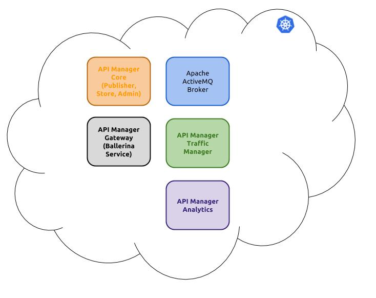

# Kubernetes Artifacts for WSO2 API Manager 3.0.0

This repository contains the Dockerfiles and the Kubernetes artifacts (Deployments and Services) that can be used to deploy WSO2 API Manager 3.0.0 on Kubernetes.



> Apache ActiveMQ is currently being used as the Message Broker that is needed for the API Manager Component communication, however this is to be replaced by a WSO2 Message Broker component that will be shipped as part of the API Manager Core Component.

## How to

### Build Docker Images
The Docker images needed for the K8S deployment are not yet available on any public Docker image registry. Therefore, they have to be locally built and pushed to the required location.

The required Dockerfiles are inside `dockerfile/` folder.

> While building the Docker images, please replace `my.docker.regsitry:5000` with the proper Docker registry URL.

1. Apache ActiveMQ
```bash
cd activemq
wget https://archive.apache.org/dist/activemq/5.14.0/apache-activemq-5.14.0-bin.tar.gz
docker build --no-cache -t my.docker.registry:5000/activemq:5.14.0 .
cd ../
```
2. API Manager Core
```bash
cd api-core
wget https://github.com/wso2/product-apim/releases/download/v3.0.0-m6/wso2apim-3.0.0-m6.zip
docker build --no-cache -t my.docker.registry:5000/apim-core:3.0.0-m6 .
cd ../
```
3. API Manager Gateway
>A modified API Manager Gateway is included in this repository to workaround [an issue](https://github.com/wso2/product-apim/issues/1509) in the shipped Gateway implementation.
```bash
cd api-gateway
wget https://github.com/wso2/product-apim/releases/download/v3.0.0-m6/wso2apim-gateway-3.0.0-m6.zip
docker build --no-cache -t my.docker.registry:5000/apim-gateway:3.0.0-m6 .
cd ../
```
4. WSO2 Identity Server as Key Manager
> WSO2 Identity Server 5.4.0 is needed for WSO2 API Manager 3 to do key validation.
```bash
cd key-manager
wget https://github.com/wso2/product-is/releases/download/v5.4.0-m2/wso2is-5.4.0-m2.zip
docker build --no-cache -t my.docker.registry:5000/is:5.4.0-m2 .
cd ../
```
5. API Manager Analytics
```bash
cd analytics
wget https://github.com/wso2/product-apim/releases/download/v3.0.0-m6/wso2apim-das-3.0.0-m6.zip
docker build --no-cache -t my.docker.registry:5000/apim-das:3.0.0-m6 .
cd ../
```

### Push Images to Registry
```bash
docker push my.docker.registry:5000/activemq:5.14.0
docker push my.docker.registry:5000/apim-core:3.0.0-m6
docker push my.docker.registry:5000/apim-gateway:3.0.0-m6
docker push my.docker.registry:5000/is:5.4.0-m2
docker push my.docker.registry:5000/apim-das:3.0.0-m6
```

### Modify and Deploy Kubernetes Artifacts
The shipped Kubernetes Artifacts, inside `pattern-1` folder, have their Docker image names prefixed with a default `docker.wso2.com` URL. The field `spec.template.spec.containers[*].image` in each `*-deployment.yaml` artifact should change so that the actual Docker registry URL is included in the Docker image name.

For example, the ActiveMQ Deployment artifact, `activemq-deployment.yaml` file, should to look like the following.
```yaml
apiVersion: extensions/v1beta1
kind: Deployment
metadata:
  name: activemq
  labels:
    app: activemq
    tier: prod
    pattern: wso2apim3-pattern-1
  namespace: wso2apim3
spec:
  strategy:
    type: Recreate
  template:
    metadata:
      labels:
        app: activemq
        tier: prod
        pattern: wso2apim3-pattern-1
    spec:
      containers:
      - image: my.docker.registry:5000/activemq:5.14.0
        name: activemq
        imagePullPolicy: Always

```

After repeating this for each Deployment artifact, run `deploy-kubernetes-sh` file. This requires `kubectl` to be installed and pointed to the proper Kubernetes cluster.
