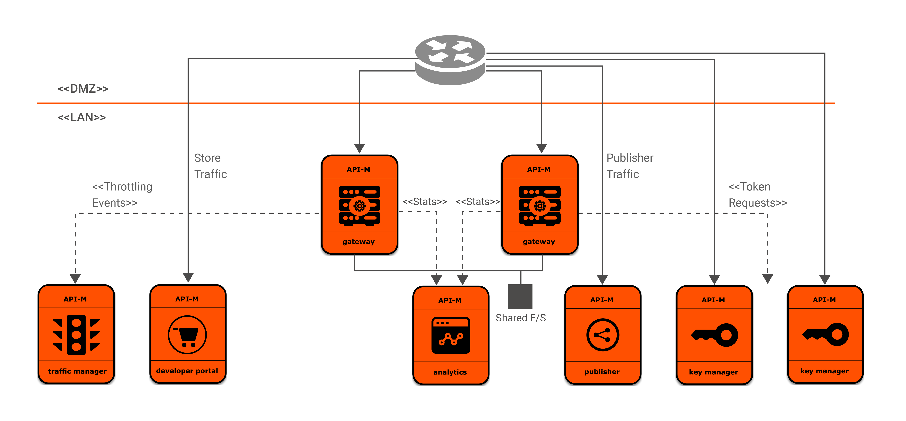

# Helm Chart for deployment of WSO2 API Manager with WSO2 API Manager Analytics



## Contents

* [Prerequisites](#prerequisites)
* [Quick Start Guide](#quick-start-guide)

## Prerequisites

* About WSO2 product Docker images used for the Kubernetes deployment
  
  For a production grade deployment of the desired WSO2 product-version, it is highly recommended to use the relevant
  Docker image which packages [WSO2 Updates](https://wso2.com/updates), available at [WSO2 Private Docker Registry](https://docker.wso2.com/).
  In order to use WSO2 product Docker images with Updates, you need an active [WSO2 Subscription](https://wso2.com/subscription).
  
  Otherwise, you can proceed with WSO2 product Docker images available at [DockerHub](https://hub.docker.com/u/wso2/), which
  package General Availability (GA) versions of WSO2 products with no WSO2 Updates.
  <br><br>

* Install [Git](https://git-scm.com/book/en/v2/Getting-Started-Installing-Git), [Helm](https://github.com/kubernetes/helm/blob/master/docs/install.md)
  (and Tiller) and [Kubernetes client](https://kubernetes.io/docs/tasks/tools/install-kubectl/) in order to run the steps
  provided in the following quick start guide.<br><br>

* An already setup [Kubernetes cluster](https://kubernetes.io/docs/setup).<br><br>

* Install [NGINX Ingress Controller](https://kubernetes.github.io/ingress-nginx/deploy/).<br><br>

* Add the WSO2 Helm chart repository.

  ```
   helm repo add wso2 https://helm.wso2.com && helm repo update
  ```

## Quick Start Guide

>In the context of this document, <br>
>* `KUBERNETES_HOME` will refer to a local copy of the [`wso2/kubernetes-apim`](https://github.com/wso2/kubernetes-apim/)
Git repository. <br>
>* `HELM_HOME` will refer to `<KUBERNETES_HOME>/advanced`. <br>

##### 1. Clone the Helm Resources for WSO2 API Manager Git repository.

```
git clone https://github.com/wso2/kubernetes-apim.git
```

##### 2. Provide configurations.

a. The default product configurations are available at `<HELM_HOME>/am-pattern-3/confs` folder. Change the configurations, as necessary.

b. Open the `<HELM_HOME>/am-pattern-3/values.yaml` and provide the following values.

###### WSO2 Subscription Configurations

| Parameter                                                                   | Description                                                                               | Default Value               |
|-----------------------------------------------------------------------------|-------------------------------------------------------------------------------------------|-----------------------------|
| `wso2.subscription.username`                                                | Your WSO2 Subscription username                                                           | ""                          |
| `wso2.subscription.password`                                                | Your WSO2 Subscription password                                                           | ""                          |

If you do not have an active WSO2 subscription, do not change the parameters `wso2.subscription.username` and `wso2.subscription.password`. 

###### Chart Dependencies

| Parameter                                                                   | Description                                                                               | Default Value               |
|-----------------------------------------------------------------------------|-------------------------------------------------------------------------------------------|-----------------------------|
| `wso2.deployment.dependencies.mysql`                                        | Enable the deployment and usage of WSO2 API Management MySQL based Helm Chart             | true                        |
| `wso2.deployment.dependencies.nfsProvisioner`                               | Enable the deployment and usage of NFS Server Provisioner (https://github.com/helm/charts/tree/master/stable/nfs-server-provisioner) | true |

###### Persistent Runtime Artifact Configurations (applicable only when `wso2.deployment.dependencies.nfsProvisioner` is disabled)

| Parameter                                                                   | Description                                                                               | Default Value               |
|-----------------------------------------------------------------------------|-------------------------------------------------------------------------------------------|-----------------------------|
| `wso2.deployment.persistentRuntimeArtifacts.nfsServerIP`                    | External NFS Server IP                                                                    | -                           |
| `wso2.deployment.persistentRuntimeArtifacts.sharedAPIMSynapseConfigsPath`   | Exported location on external NFS Server to be mounted at `<APIM_HOME>/repository/deployment/server/synapse-configs` | -            |
| `wso2.deployment.persistentRuntimeArtifacts.sharedAPIMExecutionPlansPath`   | Exported location on external NFS Server to be mounted at `<APIM_HOME>/repository/deployment/server/executionplans` | -            |

###### API Manager Server Configurations

| Parameter                                                                   | Description                                                                               | Default Value               |
|-----------------------------------------------------------------------------|-------------------------------------------------------------------------------------------|-----------------------------|
| `wso2.deployment.am.dockerRegistry`                                         | Registry location of the Docker image to be used to create API Manager instances          | -                           |
| `wso2.deployment.am.imageName`                                              | Name of the Docker image to be used to create API Manager instances                       | wso2am                      |
| `wso2.deployment.am.imageTag`                                               | Tag of the image used to create API Manager instances                                     | 3.0.0                       |
| `wso2.deployment.am.minReadySeconds`                                        | Refer to [doc](https://kubernetes.io/docs/reference/generated/kubernetes-api/v1.10/#deploymentspec-v1-apps)| 240        |
| `wso2.deployment.am.livenessProbe.initialDelaySeconds`                      | Initial delay for the live-ness probe for API Manager node                                | 240                         |
| `wso2.deployment.am.livenessProbe.periodSeconds`                            | Period of the live-ness probe for API Manager node                                        | 10                          |
| `wso2.deployment.am.readinessProbe.initialDelaySeconds`                     | Initial delay for the readiness probe for API Manager node                                | 240                         |
| `wso2.deployment.am.readinessProbe.periodSeconds`                           | Period of the readiness probe for API Manager node                                        | 10                          |
| `wso2.deployment.am.resources.requests.memory`                              | The minimum amount of memory that should be allocated for a Pod                           | 2Gi                         |
| `wso2.deployment.am.resources.requests.cpu`                                 | The minimum amount of CPU that should be allocated for a Pod                              | 2000m                       |
| `wso2.deployment.am.resources.limits.memory`                                | The maximum amount of memory that should be allocated for a Pod                           | 3Gi                         |
| `wso2.deployment.am.resources.limits.cpu`                                   | The maximum amount of CPU that should be allocated for a Pod                              | 3000m                       |
| `wso2.deployment.am.imagePullPolicy`                                        | Refer to [doc](https://kubernetes.io/docs/concepts/containers/images#updating-images)     | Always                      |

**Note**: The above mentioned default, minimum resource amounts for running WSO2 API Manager server profiles are based on its [official documentation](https://apim.docs.wso2.com/en/3.0.0/SetupAndInstall/InstallationGuide/installation-prerequisites/).

###### Analytics Dashboard Runtime Configurations

| Parameter                                                                     | Description                                                                                                      | Default Value               |
|-------------------------------------------------------------------------------|------------------------------------------------------------------------------------------------------------------|-----------------------------|
| `wso2.deployment.analytics.dashboard.dockerRegistry`                          | Registry location of the Docker image to be used to create an API Manager Analytics instance                     | -                           |
| `wso2.deployment.analytics.dashboard.imageName`                               | Name of the Docker image to be used to create an API Manager Analytics instance                                  | wso2am-analytics-dashboard     |
| `wso2.deployment.analytics.dashboard.imageTag`                                | Tag of the image used to create an API Manager Analytics instance                                                | 3.0.0                       |
| `wso2.deployment.analytics.dashboard.replicas`                                | Number of replicas of API Manager Analytics to be started                                                        | 1                           |
| `wso2.deployment.analytics.dashboard.minReadySeconds`                         | Refer to [doc](https://kubernetes.io/docs/reference/generated/kubernetes-api/v1.10/#deploymentspec-v1-apps)      |  30                         |
| `wso2.deployment.analytics.dashboard.strategy.rollingUpdate.maxSurge`         | Refer to [doc](https://kubernetes.io/docs/reference/generated/kubernetes-api/v1.10/#deploymentstrategy-v1-apps)  | 1                           |
| `wso2.deployment.analytics.dashboard.strategy.rollingUpdate.maxUnavailable`   | Refer to [doc](https://kubernetes.io/docs/reference/generated/kubernetes-api/v1.10/#deploymentstrategy-v1-apps)  | 0                           |
| `wso2.deployment.analytics.dashboard.livenessProbe.initialDelaySeconds`       | Initial delay for the live-ness probe for API Manager Analytics node                                             | 20                          |
| `wso2.deployment.analytics.dashboard.livenessProbe.periodSeconds`             | Period of the live-ness probe for API Manager Analytics node                                                     | 10                          |
| `wso2.deployment.analytics.dashboard.readinessProbe.initialDelaySeconds`      | Initial delay for the readiness probe for API Manager Analytics node                                             | 20                          |
| `wso2.deployment.analytics.dashboard.readinessProbe.periodSeconds`            | Period of the readiness probe for API Manager Analytics node                                                     | 10                          |
| `wso2.deployment.analytics.dashboard.resources.requests.memory`               | The minimum amount of memory that should be allocated for a Pod                                                  | 4Gi                         |
| `wso2.deployment.analytics.dashboard.resources.requests.cpu`                  | The minimum amount of CPU that should be allocated for a Pod                                                     | 2000m                       |
| `wso2.deployment.analytics.dashboard.resources.limits.memory`                 | The maximum amount of memory that should be allocated for a Pod                                                  | 4Gi                         |
| `wso2.deployment.analytics.dashboard.resources.limits.cpu`                    | The maximum amount of CPU that should be allocated for a Pod                                                     | 2000m                       |
| `wso2.deployment.analytics.dashboard.imagePullPolicy`                         | Refer to [doc](https://kubernetes.io/docs/concepts/containers/images#updating-images)                            | Always                      |

###### Analytics Worker Runtime Configurations

| Parameter                                                                  | Description                                                                                                         | Default Value               |
|----------------------------------------------------------------------------|---------------------------------------------------------------------------------------------------------------------|-----------------------------|
| `wso2.deployment.analytics.worker.dockerRegistry`                          | Registry location of the Docker image to be used to create an API Manager Analytics instance                        | -                           |
| `wso2.deployment.analytics.worker.imageName`                               | Name of the Docker image to be used to create an API Manager Analytics instance                                     | wso2am-analytics-worker     |
| `wso2.deployment.analytics.worker.imageTag`                                | Tag of the image used to create an API Manager Analytics instance                                                   | 3.0.0                       |
| `wso2.deployment.analytics.worker.replicas`                                | Number of replicas of API Manager Analytics to be started                                                           | 1                           |
| `wso2.deployment.analytics.worker.minReadySeconds`                         | Refer to [doc](https://kubernetes.io/docs/reference/generated/kubernetes-api/v1.10/#deploymentspec-v1-apps)         | 30                          |
| `wso2.deployment.analytics.worker.strategy.rollingUpdate.maxSurge`         | Refer to [doc](https://kubernetes.io/docs/reference/generated/kubernetes-api/v1.10/#deploymentstrategy-v1-apps)     | 1                           |
| `wso2.deployment.analytics.worker.strategy.rollingUpdate.maxUnavailable`   | Refer to [doc](https://kubernetes.io/docs/reference/generated/kubernetes-api/v1.10/#deploymentstrategy-v1-apps)     | 0                           |
| `wso2.deployment.analytics.worker.livenessProbe.initialDelaySeconds`       | Initial delay for the live-ness probe for API Manager Analytics node                                                | 20                          |
| `wso2.deployment.analytics.worker.livenessProbe.periodSeconds`             | Period of the live-ness probe for API Manager Analytics node                                                        | 10                          |
| `wso2.deployment.analytics.worker.readinessProbe.initialDelaySeconds`      | Initial delay for the readiness probe for API Manager Analytics node                                                | 20                          |
| `wso2.deployment.analytics.worker.readinessProbe.periodSeconds`            | Period of the readiness probe for API Manager Analytics node                                                        | 10                          |
| `wso2.deployment.analytics.worker.resources.requests.memory`               | The minimum amount of memory that should be allocated for a Pod                                                     | 4Gi                         |
| `wso2.deployment.analytics.worker.resources.requests.cpu`                  | The minimum amount of CPU that should be allocated for a Pod                                                        | 2000m                       |
| `wso2.deployment.analytics.worker.resources.limits.memory`                 | The maximum amount of memory that should be allocated for a Pod                                                     | 4Gi                         |
| `wso2.deployment.analytics.worker.resources.limits.cpu`                    | The maximum amount of CPU that should be allocated for a Pod                                                        | 2000m                       |
| `wso2.deployment.analytics.worker.imagePullPolicy`                         | Refer to [doc](https://kubernetes.io/docs/concepts/containers/images#updating-images)                               | Always                      |

###### Kubernetes Specific Configurations

| Parameter                                                     | Description                                                                               | Default Value                   |
|---------------------------------------------------------------|-------------------------------------------------------------------------------------------|---------------------------------|
| `kubernetes.serviceAccount`                                   | Name of the Kubernetes Service Account to which the Pods are to be bound                  | wso2am-pattern-3-svc-account    |

##### 4. Deploy WSO2 API Manager pattern-3.

```
helm install --dep-up --name <RELEASE_NAME> <HELM_HOME>/am-pattern-3 --namespace <NAMESPACE>
```

##### 5. Access Management Console:

a. Obtain the external IP (`EXTERNAL-IP`) of the Ingress resources by listing down the Kubernetes Ingresses.

  ```
  kubectl get ing -n <NAMESPACE>
  ```

e.g.

```
NAME                                               HOSTS                                                ADDRESS          PORTS      AGE
wso2am-pattern-3-am-gateway-ingress               <RELEASE_NAME>-gateway                                <EXTERNAL-IP>    80, 443    7m
wso2am-pattern-3-am-ingress                       <RELEASE_NAME>-devportal,<RELEASE_NAME>-publisher     <EXTERNAL-IP>    80, 443    7m
wso2am-pattern-3-am-analytics-dashboard-ingress   <RELEASE_NAME>-analytics-dashboard                    <EXTERNAL-IP>    80, 443    7m
```

b. Add the above hosts as entries in `/etc/hosts` file as follows:

  ```
  <EXTERNAL-IP>	<RELEASE_NAME>-am
  <EXTERNAL-IP>	<RELEASE_NAME>-gateway
  <EXTERNAL-IP>	<RELEASE_NAME>-analytics-dashboard
  ```

c. Try navigating to `https://<RELEASE_NAME>-am/carbon`, `https://<RELEASE_NAME>-am/publisher` and `https://<RELEASE_NAME>-am/devportal` from your favorite browser.