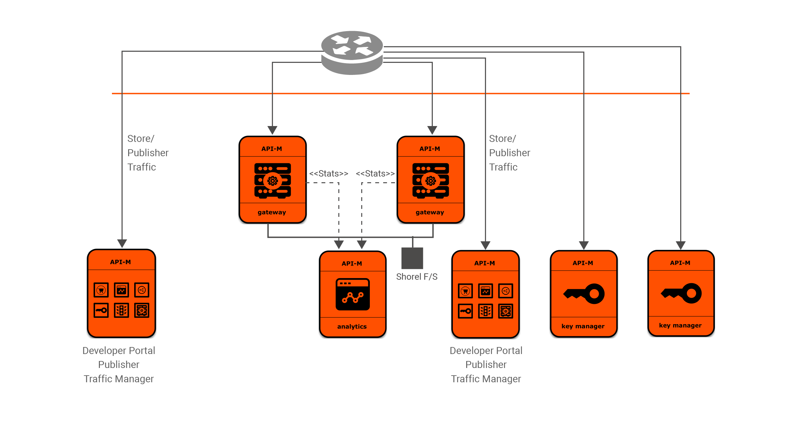

# Kubernetes Resources for deployment of WSO2 API Manager with a separate Gateway and a separate Key Manager

**Note**: We consider Helm to be the primary source of installation of WSO2 product deployment patterns in Kubernetes environments. Hence, pure Kubernetes resources for product deployment patterns will be deprecated from 2.6.0.8 onwards. Please adjust your usage accordingly.

Core Kubernetes resources for [WSO2 API Manager deployment pattern 2](https://docs.wso2.com/display/AM220/Deployment+Patterns#DeploymentPatterns-Pattern2).
This consists of a deployment of WSO2 API Manager with a separate Gateway and a separate Key Manager along with WSO2 API Manager Analytics support.



## Contents

* [Prerequisites](#prerequisites)
* [Quick Start Guide](#quick-start-guide)

## Prerequisites

* In order to use Docker images with WSO2 updates, you need an active WSO2 subscription. If you do not possess an active WSO2
  subscription, you can sign up for a WSO2 Free Trial Subscription from [here](https://wso2.com/free-trial-subscription).
  Otherwise, you can proceed with Docker images which are created using GA releases.<br><br>

* Install [Git](https://git-scm.com/book/en/v2/Getting-Started-Installing-Git) and [Kubernetes client](https://kubernetes.io/docs/tasks/tools/install-kubectl/)
in order to run the steps provided in the following quick start guide.<br><br>

* An already setup [Kubernetes cluster](https://kubernetes.io/docs/setup/pick-right-solution/).<br><br>

* A pre-configured Network File System (NFS) to be used as the persistent volume for artifact sharing and persistence.
In the NFS server instance, create a Linux system user account named `wso2carbon` with user id `802` and a system group named `wso2` with group id `802`.
Add the `wso2carbon` user to the group `wso2`.

  ```
  groupadd --system -g 802 wso2
  useradd --system -g 802 -u 802 wso2carbon
  ```  
> If you are using AKS(Azure Kubernetes Service) as the kubernetes provider, it is possible to use Azurefiles for persistent storage instead of an NFS. If doing so, skip this step.

## Quick Start Guide

>In the context of this document, `KUBERNETES_HOME` will refer to a local copy of the [`wso2/kubernetes-apim`](https://github.com/wso2/kubernetes-apim/)
Git repository.<br>

##### 1. Clone the Kubernetes Resources for WSO2 API Manager Git repository.

```
git clone https://github.com/wso2/kubernetes-apim.git
```

##### 2. Create a namespace named `wso2` and a service account named `wso2svc-account`, within the namespace `wso2`.

```
kubectl create namespace wso2
kubectl create serviceaccount wso2svc-account -n wso2
```

Then, switch the context to new `wso2` namespace.

```
kubectl config set-context $(kubectl config current-context) --namespace=wso2
```

##### 3. [Optional] If you are using Docker images with WSO2 updates, perform the following changes.

* Change the Docker image names such that each Kubernetes Deployment use WSO2 product Docker images from [`WSO2 Docker Registry`](https://docker.wso2.com).

  Change the Docker image name, i.e. the `image` attribute under the [container specification](https://kubernetes.io/docs/reference/generated/kubernetes-api/v1.14/#container-v1-core)
  of each Kubernetes Deployment resource.

  For example, change the default `wso2/wso2am:2.6.0` WSO2 API Manager Docker image available at [DockerHub](https://hub.docker.com/u/wso2/) to
  `docker.wso2.com/wso2am:2.6.0` WSO2 API Manager Docker image available at [`WSO2 Docker Registry`](https://docker.wso2.com).

* Create a Kubernetes Secret for pulling the required Docker images from [`WSO2 Docker Registry`](https://docker.wso2.com).

  Create a Kubernetes Secret named `wso2creds` in the cluster to authenticate with the WSO2 Docker Registry, to pull the required images.

  ```
  kubectl create secret docker-registry wso2creds --docker-server=docker.wso2.com --docker-username=<WSO2_USERNAME> --docker-password=<WSO2_PASSWORD> --docker-email=<WSO2_USERNAME>
  ```

  `WSO2_USERNAME`: Your WSO2 username<br>
  `WSO2_PASSWORD`: Your WSO2 password

  Please see [Kubernetes official documentation](https://kubernetes.io/docs/tasks/configure-pod-container/pull-image-private-registry/#create-a-secret-in-the-cluster-that-holds-your-authorization-token)
  for further details.

  Also, add the created `wso2creds` Kubernetes Secret as an entry to Kubernetes Deployment resources. Please add the following entry
  under the [Kubernetes Pod Specification](https://kubernetes.io/docs/reference/generated/kubernetes-api/v1.14/#podspec-v1-core) `PodSpec` in each Deployment resource.

  ```
  imagePullSecrets:
  - name: wso2creds
  ```

The Kubernetes Deployment definition file(s) that need to be updated are as follows:

* `<KUBERNETES_HOME>/advanced/pattern-2/apim-analytics/wso2apim-analytics-deployment.yaml`
* `<KUBERNETES_HOME>/advanced/pattern-2/apim-gw/wso2apim-gateway-deployment.yaml`
* `<KUBERNETES_HOME>/advanced/pattern-2/apim-pub-store-tm/wso2apim-pub-store-tm-1-deployment.yaml`
* `<KUBERNETES_HOME>/advanced/pattern-2/apim-pub-store-tm/wso2apim-pub-store-tm-2-deployment.yaml`

If you are using WSO2 API Manager's Key Manager profile, edit the following file.

* `<KUBERNETES_HOME>/advanced/pattern-2/apim-km/wso2apim-km-deployment.yaml`

Else, if you are using WSO2 Identity Server as Key Manager, edit the following file.

* `<KUBERNETES_HOME>/advanced/pattern-2/apim-is-as-km/wso2apim-is-as-km-deployment.yaml`

##### 4. Setup product database(s).

Setup the external product databases. Please refer to WSO2 API Manager's [official documentation](https://docs.wso2.com/display/AM260/Installing+and+Configuring+the+Databases)
on creating the required databases for the deployment.

Provide appropriate connection URLs, corresponding to the created external databases and the relevant driver class names for the data sources defined in
the following files:

* `<KUBERNETES_HOME>/advanced/pattern-2/confs/apim-analytics/conf/worker/deployment.yaml`
* `<KUBERNETES_HOME>/advanced/pattern-2/confs/apim-pub-store-tm-1/datasources/master-datasources.xml`
* `<KUBERNETES_HOME>/advanced/pattern-2/confs/apim-pub-store-tm-2/datasources/master-datasources.xml`

If you are using WSO2 API Manager's Key Manager profile, edit the following file.

* `<KUBERNETES_HOME>/advanced/pattern-2/confs/apim-km/datasources/master-datasources.xml`

Else, if you are using WSO2 Identity Server as Key Manager, edit the following file.

* `<KUBERNETES_HOME>/advanced/pattern-2/confs/apim-is-as-km/datasources/master-datasources.xml`

Please refer WSO2's [official documentation](https://docs.wso2.com/display/ADMIN44x/Configuring+master-datasources.xml) on configuring data sources.

**Note**:

* For **evaluation purposes**, you can use Kubernetes resources provided in the directory<br>
`<KUBERNETES_HOME>/advanced/pattern-2/extras/rdbms/mysql` for deploying the product databases, using MySQL in Kubernetes. However, this approach of product database deployment is
**not recommended** for a production setup.

* For using these Kubernetes resources,

    first create a Kubernetes ConfigMap for passing database script(s) to the deployment.

    ```
    kubectl create configmap mysql-dbscripts --from-file=<KUBERNETES_HOME>/advanced/pattern-2/extras/confs/mysql/dbscripts/
    ```

    Here, one of the following storage options is required to persist MySQL DB data.

    * Using Azure Files on AKS,
        ```
        kubectl apply -f <KUBERNETES_HOME>/azure/rbac.yaml
        kubectl apply -f <KUBERNETES_HOME>/azure/mysql-storage-class.yaml
        kubectl create -f <KUBERNETES_HOME>/advanced/pattern-2/extras/rdbms/mysql/mysql-persistent-volume-claim-azure.yaml
        ```

    * Using NFS

      Create and export a directory within the NFS server instance.

      Provide read-write-execute permissions to other users for the created folder.

      Update the Kubernetes Persistent Volume resource with the corresponding NFS server IP (`NFS_SERVER_IP`) and exported,
      NFS server directory path (`NFS_LOCATION_PATH`) in `<KUBERNETES_HOME>/advanced/pattern-2/extras/rdbms/volumes/persistent-volumes.yaml`.

      Deploy the persistent volume resource and volume claim as follows:

      ```
      kubectl create -f <KUBERNETES_HOME>/advanced/pattern-2/extras/rdbms/mysql/mysql-persistent-volume-claim.yaml
      kubectl create -f <KUBERNETES_HOME>/advanced/pattern-2/extras/rdbms/volumes/persistent-volumes.yaml
      ```

    Then, create a Kubernetes service (accessible only within the Kubernetes cluster), followed by the MySQL Kubernetes deployment, as follows:

    ```
    kubectl create -f <KUBERNETES_HOME>/advanced/pattern-2/extras/rdbms/mysql/mysql-service.yaml
    kubectl create -f <KUBERNETES_HOME>/advanced/pattern-2/extras/rdbms/mysql/mysql-deployment.yaml
    ```

##### 5. Create a Kubernetes role and a role binding necessary for the Kubernetes API requests made from Kubernetes membership scheme.

```
kubectl create -f <KUBERNETES_HOME>/rbac/rbac.yaml
```

##### 6. Setup persistent storage.

* Using Azurefiles,

  ```
  kubectl apply -f <KUBERNETES_HOME>/azure/rbac.yaml
  kubectl apply -f <KUBERNETES_HOME>/azure/storage-class.yaml
  kubectl create -f <KUBERNETES_HOME>/advanced/pattern-2/apim-is-as-km/wso2apim-is-as-km-volume-claim-azure.yaml
  kubectl create -f <KUBERNETES_HOME>/advanced/pattern-2/apim-gw/wso2apim-gateway-volume-claim-azure.yaml
  kubectl create -f <KUBERNETES_HOME>/advanced/pattern-2/apim-pub-store-tm/wso2apim-pub-store-tm-volume-claim-azure.yaml
  ```


* Using a Network File System (NFS),

  Create and export unique directories within the NFS server instance for each Kubernetes Persistent Volume resource defined in the
  `<KUBERNETES_HOME>/advanced/pattern-2/volumes/persistent-volumes.yaml` file.

  Grant ownership to `wso2carbon` user and `wso2` group, for each of the previously created directories.

  ```
  sudo chown -R wso2carbon:wso2 <directory_name>
  ```

  Grant read-write-execute permissions to the `wso2carbon` user, for each of the previously created directories.

  ```
  chmod -R 700 <directory_name>
  ```

  Update each Kubernetes Persistent Volume resource with the corresponding NFS server IP (`NFS_SERVER_IP`) and exported, NFS server directory path (`NFS_LOCATION_PATH`).

  Then, deploy the Kubernetes Persistent Volume and Volume Claim resources as follows:

  * Kubernetes Persistent Volume Claim resource for the shared volume mount for runtime artifacts created at
  `<APIM_HOME>/repository/deployment/server/synapse-configs` directory in Gateway profile deployment.

  ```
  kubectl create -f <KUBERNETES_HOME>/advanced/pattern-2/apim-gw/wso2apim-gateway-volume-claim.yaml
  ```

  * Kubernetes Persistent Volume Claim resource for the shared volume mount for runtime artifacts created at
  `<APIM_HOME>/repository/deployment/server/executionplans` directory in Publisher-Store-Traffic-Manager profile deployment.

  ```
  kubectl create -f <KUBERNETES_HOME>/advanced/pattern-2/apim-pub-store-tm/wso2apim-pub-store-tm-volume-claim.yaml
  ```

  * Kubernetes Persistent Volume resources for the above Volume Claims created.

  ```
  kubectl create -f <KUBERNETES_HOME>/advanced/pattern-2/volumes/persistent-volumes.yaml
  ```

##### 7. Create Kubernetes ConfigMaps for passing WSO2 product configurations into the Kubernetes cluster.

```
kubectl create configmap apim-analytics-conf-worker --from-file=<KUBERNETES_HOME>/advanced/pattern-2/confs/apim-analytics/conf/worker

kubectl create configmap apim-pub-store-tm-1-conf --from-file=<KUBERNETES_HOME>/advanced/pattern-2/confs/apim-pub-store-tm-1/
kubectl create configmap apim-pub-store-tm-1-conf-datasources --from-file=<KUBERNETES_HOME>/advanced/pattern-2/confs/apim-pub-store-tm-1/datasources/
kubectl create configmap apim-pub-store-tm-2-conf --from-file=<KUBERNETES_HOME>/advanced/pattern-2/confs/apim-pub-store-tm-2/
kubectl create configmap apim-pub-store-tm-2-conf-datasources --from-file=<KUBERNETES_HOME>/advanced/pattern-2/confs/apim-pub-store-tm-2/datasources/

kubectl create configmap apim-gateway-conf --from-file=<KUBERNETES_HOME>/advanced/pattern-2/confs/apim-gateway/
kubectl create configmap apim-gateway-conf-axis2 --from-file=<KUBERNETES_HOME>/advanced/pattern-2/confs/apim-gateway/axis2/
```

If you are using WSO2 API Manager's Key Manager profile, deploy the following Kubernetes ConfigMaps.

```
kubectl create configmap apim-km-conf --from-file=<KUBERNETES_HOME>/advanced/pattern-2/confs/apim-km/
kubectl create configmap apim-km-conf-datasources --from-file=<KUBERNETES_HOME>/advanced/pattern-2/confs/apim-km/datasources/
```

Else, if you are using WSO2 Identity Server as Key Manager, deploy the following Kubernetes ConfigMaps.

```
kubectl create configmap apim-is-as-km-conf --from-file=<KUBERNETES_HOME>/advanced/pattern-2/confs/apim-is-as-km/
kubectl create create -f <KUBERNETES_HOME>/advanced/pattern-2/confs/apim-is-as-km/init/init.yaml
kubectl create configmap apim-is-as-km-conf-axis2 --from-file=<KUBERNETES_HOME>/advanced/pattern-2/confs/apim-is-as-km/axis2/
kubectl create configmap apim-is-as-km-conf-datasources --from-file=<KUBERNETES_HOME>/advanced/pattern-2/confs/apim-is-as-km/datasources/
```

##### 8. Create Kubernetes Services for WSO2 API Manager and Analytics.

```
kubectl create -f <KUBERNETES_HOME>/advanced/pattern-2/apim-analytics/wso2apim-analytics-service.yaml
kubectl create -f <KUBERNETES_HOME>/advanced/pattern-2/apim-pub-store-tm/wso2apim-pub-store-tm-1-service.yaml
kubectl create -f <KUBERNETES_HOME>/advanced/pattern-2/apim-pub-store-tm/wso2apim-pub-store-tm-2-service.yaml
kubectl create -f <KUBERNETES_HOME>/advanced/pattern-2/apim-pub-store-tm/wso2apim-pub-store-tm-service.yaml
kubectl create -f <KUBERNETES_HOME>/advanced/pattern-2/apim-gw/wso2apim-gateway-service.yaml
```

If you are using WSO2 API Manager's Key Manager profile, deploy the following Kubernetes Service.

```
kubectl create -f <KUBERNETES_HOME>/advanced/pattern-2/apim-km/wso2apim-km-service.yaml
```

Else, if you are using WSO2 Identity Server as Key Manager, deploy the following Kubernetes Service.

```
kubectl create -f <KUBERNETES_HOME>/advanced/pattern-2/apim-is-as-km/wso2apim-is-as-km-service.yaml
```

##### 9. Create Kubernetes Deployments for WSO2 API Manager and Analytics.

* Create the Kubernetes Deployment for WSO2 API Manager Analytics Worker profile.

```
kubectl create -f <KUBERNETES_HOME>/advanced/pattern-2/apim-analytics/wso2apim-analytics-deployment.yaml
```

Ensure that the Analytics Worker profile pod is successfully deployed and ready to serve requests.
You can execute `kubectl get pods` command to achive this.

* Create the Kubernetes Deployment for Key Manager profile.

If you are using WSO2 API Manager's Key Manager profile, create the following Kubernetes Deployment.

```
kubectl create -f <KUBERNETES_HOME>/advanced/pattern-2/apim-km/wso2apim-km-deployment.yaml
```

Else, if you are using WSO2 Identity Server as Key Manager, create the following Kubernetes Deployment.

```
kubectl create -f <KUBERNETES_HOME>/advanced/pattern-2/apim-is-as-km/wso2apim-is-as-km-deployment.yaml
```

Ensure that the Key Manager profile pod is successfully deployed and ready to serve requests.

* Create the Kubernetes Deployment for WSO2 API Manager Publisher-Store-Traffic-Manager profiles.

Create the Kubernetes Deployment for the first node of WSO2 API Manager Publisher-Store-Traffic-Manager profiles.

```
kubectl create -f <KUBERNETES_HOME>/advanced/pattern-2/apim-pub-store-tm/wso2apim-pub-store-tm-1-deployment.yaml
```

Ensure the Kubernetes pod for the first node of WSO2 API Manager Publisher-Store-Traffic-Manager profiles is successfully
deployed and ready to serve requests.

Then, create the Kubernetes Deployment for the second node of WSO2 API Manager Publisher-Store-Traffic-Manager profiles.

```
kubectl create -f <KUBERNETES_HOME>/advanced/pattern-2/apim-pub-store-tm/wso2apim-pub-store-tm-2-deployment.yaml
```

Ensure the Kubernetes pod is up and running and ready to serve requests.

* Create the Kubernetes Deployment for WSO2 API Manager Gateway profile.

```
kubectl create -f <KUBERNETES_HOME>/advanced/pattern-2/apim-gw/wso2apim-gateway-deployment.yaml
```

Ensure the Kubernetes pod for WSO2 API Manager's Gateway profile is up and running and ready to serve requests.

##### 10. Deploy Kubernetes Ingress resources.

The WSO2 API Manager Kubernetes Ingress resources uses the NGINX Ingress Controller maintained by Kubernetes.

In order to enable the NGINX Ingress controller in the desired cloud or on-premise environment,
please refer the official documentation, [NGINX Ingress Controller Installation Guide](https://kubernetes.github.io/ingress-nginx/deploy/).

Finally, deploy the WSO2 API Manager Kubernetes Ingress resources as follows:

```
kubectl create -f <KUBERNETES_HOME>/advanced/pattern-2/ingresses/wso2apim-gateway-ingress.yaml
kubectl create -f <KUBERNETES_HOME>/advanced/pattern-2/ingresses/wso2apim-ingress.yaml
```

##### 11. Access Management Consoles.

Default deployment will expose `wso2apim` and `wso2apim-gateway` hosts.

To access the console in the environment,

a. Obtain the external IP (`EXTERNAL-IP`) of the Ingress resources by listing down the Kubernetes Ingresses.

  ```
  kubectl get ing
  ```

e.g.

```
NAME                                  HOSTS                    ADDRESS          PORTS      AGE
wso2apim-ingress                      wso2apim                 <EXTERNAL-IP>    80, 443    7m
wso2apim-gateway-ingress              wso2apim-gateway         <EXTERNAL-IP>    80, 443    6m
```

b. Add the above host as an entry in `/etc/hosts` file as follows:

```
<EXTERNAL-IP>	wso2apim
<EXTERNAL-IP>	wso2apim-gateway
```

c. Try navigating to `https://wso2apim/carbon` from your favorite browser.

##### 12. Scale up the Key Manager and Gateway profiles.

Default deployment runs a single replica (or pod) of Key Manager profile and WSO2 API Manager Gateway.
To scale any of these profile deployments into any `<n>` number of container replicas, upon your requirement,
simply run `kubectl scale` Kubernetes client command on the terminal.

For example, the following command scales the WSO2 API Manager Gateway profile to the desired number of replicas.

```
kubectl scale --replicas=<n> -f <KUBERNETES_HOME>/advanced/pattern-2/apim-gw/wso2apim-gateway-deployment.yaml
```

If `<n>` is 2, you are here scaling up this deployment from 1 to 2 container replicas.
