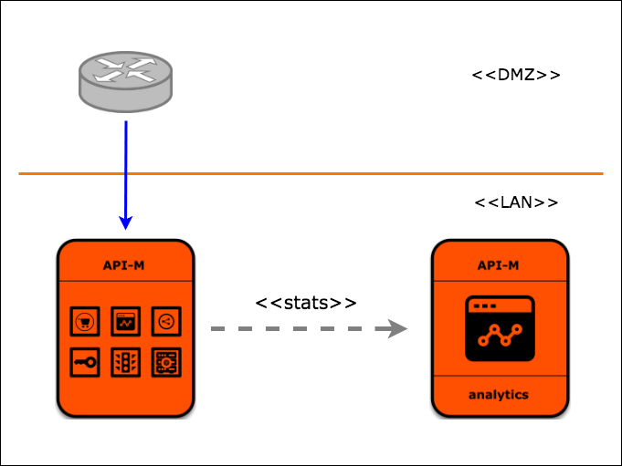

# Simplified setup for WSO2 Kubernetes API Manager



## Contents

* [Prerequisites](#prerequisites)
* [Quick Start Guide](#quick-start-guide)

## Prerequisites

* Install [Kubernetes  Client](https://kubernetes.io/docs/tasks/tools/install-kubectl/) in order to run the steps provided in the following Quick Start Guide.

* An already setup Kubernetes cluster. If you haven’t already setup a K8s cluster  Refer [the guide](https://kubernetes.io/docs/setup/learning-environment/minikube/).
  >This artifact doesn't support [Docker Desktop](https://www.docker.com/products/docker-desktop). 

* WSO2 subscribed users can run [wso2am-latest.sh](https://github.com/wso2/kubernetes-apim/blob/3.2.x/simple/deployment-scripts/wso2am-latest.sh) with the latest updates by providing their subscription Username and Password. If you do not possess an active WSO2 subscription already, run [wso2am-ga.sh](https://github.com/wso2/kubernetes-apim/blob/3.2.x/simple/deployment-scripts/wso2am-ga.sh) which does not require subscription credentials. 
Further users can acquire a subscription by referring to this [link](https://wso2.com/subscription).

*From this point forward the respective script (wso2am-ga.sh and wso2am-latest.sh) will be identified as SIMPLIFIED_SCRIPT*

## Quick Start Guide

1. Download(https://github.com/wso2/kubernetes-apim/tree/3.2.x/simple/deployment-scripts) simplified Kubernetes setup
 (SIMPLIFIED_SCRIPT) for WSO2 API Manager.  

2. In the command line, move into the directory where you have downloaded the SIMPLIFIED_SCRIPT.

3. Provide permissions for the setup file to execute by running 

```
chmod +x SIMPLIFIED_SCRIPT
```

4. Run the following command on your terminal. This will deploy WSO2 API Manager in your cluster.

```
./SIMPLFIED_SCRIPT --deploy
```

5. Open a browser and go to 
- https://<NODE_IP>:30443/carbon/
- https://<NODE_IP>:30443/publisher/
- https://<NODE_IP>:30443/devportal/
- https://<NODE_IP>:30646/analytics-dashboard/

use username: admin and password: admin as default login credentials.

*Your < NODE-IP > will be provided at the end of the deployment.*

6. Try WSO2 API Manager by following **[WSO2 API Manager - Quick Start Guide](https://apim.docs.wso2.com/en/latest/GettingStarted/quick-start-guide/)**.
